# Sky Blaster — 2차 발표

> **종스크롤 슈팅 × 로그라이크** — Android 2D Game
> 1차 발표 시점 (4월 6일) 의 계획 대비 5월 9일 기준 진행 보고

---

## 1. 게임에 대한 간단한 소개

**Sky Blaster** 는 종스크롤 슈팅 장르와 로그라이크 시스템을 결합한 안드로이드 모바일 게임이다. 사용자는 화면을 터치한 채 드래그해 캐릭터를 자유롭게 이동시키고, 총알은 자동으로 발사된다. 일반 스테이지에서몰려오는 적을 처치하여 경험치를 얻어 레벨업을해 랜덤한 보상을 획득할 수 있고, 정해진 시간마다 보스 스테이지에 진입할지 계속 레벨업을 할 지 선택할 수있다.
보스 스테이지에서는 보스와 싸우며 보스를 잡으면 최종 클리어하는 게임이다.

게임의 전반적인 시스템은 다음과 같다:
플레이어 조작 : 자동발사, 드래그 이동, 터치 스킬
레벨업 보상 : 능력치 증가, 특수 무기, 스킬
몬스터 : 자폭/원거리/분열/보스몬스터 
종료지점 : 플레이어 사망 / 보스처치
재미 포인트 : 로그라이크를 통해 내가 원하는 빌드를 개척하고 보스를 잡을 타이밍을 선택함으로써 불합리한 상태에서 싸우는 불상사를 막고 후에 점수랭킹 혹은 클리어타임 랭킹 시스템까지 고려

---

## 2. 현재까지의 진행 상황

> 1차 발표 때 정한 8주 일정 기준 항목별 진행도

| 주차 | 항목 | 진행도 | 내용 |
|------|------|------|------|
| **1주차** | 프로젝트 셋업 (CustomView, Scene 전환 구조, 리소스) | **85%** | 보스몬스터 관련 리소스, 사운드 리소스를 제외하고 전부 완료 |
| **2주차** | 플레이어 + 자동 발사 + 스크롤 배경 | **100%** | 플레이어, 자동 발사, sky_bg + sky_star 2종 스크롤 배경 전부 완료 |
| **3주차** | 적 3종 + 충돌 + ObjectPool | **100%** | 자폭 / 원거리 / 분열  몬스터 전부 구현 완료(objectpool도 완료) |
| **4주차** | EXP + 레벨업 보상 시스템 | **100%** | 경험치 드랍 및 레벨업 보상 UI 완료, 샷건 / 유도미사일/ 레이저 무기 구현 완료 |
| **5주차** | 스킬 + 능력치 + 보스 진입 UI | **100%** | 힐 / 광역 데미지 / 광폭화 스킬 구현 완료, 능력치 증가 , 보스 진입 ui 구현 ㅇ완료 |
| **6주차** | 보스전 (Bezier 패턴, 보스 HP) | **10%** | 보스 스테이지 배경, 보스 스테이지 진입 구조만 구현 완료 |
| **7주차** | 이펙트 + 사운드 + 타이틀/결과/Pause | **35%** | 스킬 애니메이션, 적 사망 단일 vfx, 명중 vfx만 구현 완료 |
| **8주차** | 버그 검토 및 최종 완성 | **0%** | 미시작  |

**전체 진행도 추정: 약 65%**

---

## 3. Git Commit 활동

### GitHub Insights — Commits 그래프


### 주차별 commit 수

> GitHub Insights 기준 (일요일~토요일) 주차 집계

| 주차 | 기간 | Commit 수 | 주요 작업 |
|------|------|----------|----------|
| **1주차** | 4/5 ~ 4/11 | **14** | README 작성·수정, 프레임워크 도입, 타이틀/메인 신, 플레이어 + 자동 공격, 보스 진입 타이머 |
| **2주차** | 4/12 ~ 4/18 | **6** | 프레임워크 업데이트, 별 레이어 / 디버그 추가, 몬스터 소환·이동, 충돌 데미지·점수 |
| **3주차** | 4/19 ~ 4/25 | **5** | 자폭/원거리/분열형 몬스터 3종, VFX 추가, 몬스터 소환 균형 조정 |
| **4주차** | 4/26 ~ 5/2 | **5** | EXP 시스템, 레벨업 씬, 카드 보상 + 데미지 시각화, 무기 2종 (샷건/유도) |
| **5주차** | 5/3 ~ 5/9 | **11** | 프레임워크 업데이트, 레이저 무기, 카드풀 무기/스킬 추가, 보스 진입 UI, 스킬 3종 (폭발/힐/광폭화), 레벨 디자인, 가시성 개선 |
| 6~8주차 | 5/10 ~ | 0 | 진행 예정 |
| **합계** | | **41** | |
---

## 4. Activity 구성

| Activity | 역할 |
|----------|------|
| **`MainActivity`** | 앱 진입점. 단일 `Start Game` 버튼이 있는 임시 타이틀 화면. 버튼 탭 시 `SkyBlasterActivity` 로 startActivity. (정식 타이틀 화면은 7주차 예정) |
| **`SkyBlasterActivity`** | 게임 본체. `BaseGameActivity` (a2dg 프레임워크) 를 상속받아 `createRootScene()` 에서 `MainScene` 을 root scene 으로 띄운다. `drawsDebugInfo = BuildConfig.DEBUG` 로 debug 빌드에서만 FPS·grid 등 표시. |

---

## 5. Scene 구성 및 전환 관계

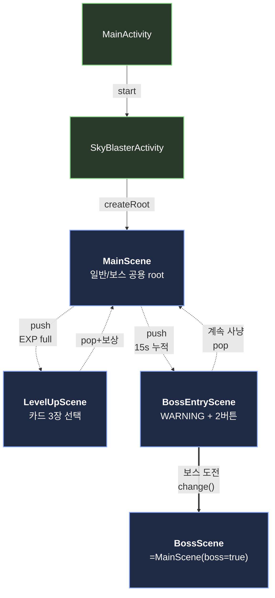

> 점선 = transparent overlay 의 push/pop, 굵은 실선 = `change()` 로 root 교체.

- **MainScene** 이 root. 두 종류의 transparent overlay 가 위에 push 된다.
  - **LevelUpScene**: `player.exp >= maxExp` 가 되는 프레임에 자동 push. 카드 선택 후 pop + 보상 적용.
  - **BossEntryScene**: `elapsedSec` 가 `BOSS_ENTER_TIME` (현재 테스트 값 15s) 에 도달할 때마다 push. overlay 가 위에 있는 동안은 MainScene 의 `update()` 가 호출되지 않으므로 게임 시간 (`elapsedSec`) 과 적 스폰도 함께 정지.
- **BossScene** 은 `MainScene` 을 상속해 배경/플래그만 다르게 두고 같은 게임 루프를 재사용. 진입은 `push` 가 아니라 `change()` 로 root 자체를 교체하기 때문에 일반 스테이지로 되돌아갈 수 없다.

---

## 6. MainScene 의 Game Object


### Player

<table cellpadding="10">
<tr>
<th align="left" width="200">항목</th>
<th align="left">내용</th>
</tr>
<tr>
<td valign="top"><b>클래스 구성 정보</b></td>
<td>
<b>▸ 그림 구성</b><br/>
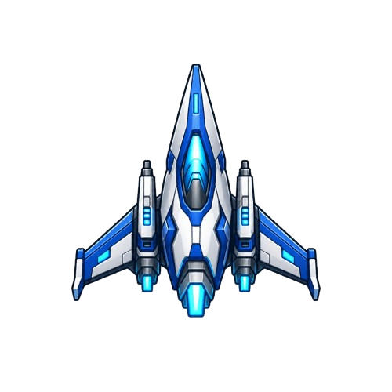
<br/>
파란색 우주 전투기. 화면 정중앙 하단 부근에서 시작한다.
<br/><br/>
<b>▸ 동작 구성</b><br/>
손가락을 따라 이동하면서 자동으로 무기를 발사한다. 무기·능력치 카드·광폭화 버프가 한 클래스 안에서 통합 관리되어, 발사 패턴·속도·데미지가 모두 그 조합으로 결정된다.
</td>
</tr>
<tr>
<td valign="top"><b>상호작용 정보</b></td>
<td>
적 / 적탄과 충돌하면  HP 가 깎이고, 0 이 되면  GAME OVER. ExpOrb 를 흡수하면  EXP 가 적립되고, ,EXP가 다 차면 LevelUpScene이 나타나고  카드 보상을 선택하면 즉시 능력치/무기/스킬에 반영된다. </td>
</tr>
<tr>
<td valign="top"><b>UX 진행 방법</b></td>
<td>
화면 드래그하면 플레이어가 따라오고, 손을 떼면 그 자리에 정지. 카드를 고른 즉시 발사 패턴이 바뀜. 우하단 스킬버튼 영역은 잘못터치하여 드래그이 동이 안 되도록 방지하여, 위급한 순간에 스킬을 누르려다 플레이어가 끌려가는 사고를 방지.
</td>
</tr>
</table>

#### 핵심 코드

**`calculatePower()` — 매 발사 데미지 공식**

```kotlin
val basePower = (Bullet.DAMAGE * attackMul * attackBuffMul).toInt().coerceAtLeast(1)
val isCrit = Random.nextFloat() < critRate
val power = if (isCrit) basePower * CRIT_MUL else basePower
```

`Bullet.DAMAGE` 에 `attackMul` 과 `attackBuffMul` 을 곱한 값을 base 로 하고 (최소 1 보장), `Random.nextFloat() < critRate` 면 그 값에 `CRIT_MUL` (=3) 을 한 번 더 곱해 isCrit 와 함께 반환한다.

**`update()` 안의 부드러운 추종 이동**

```kotlin
val step = SPEED * gctx.frameTime
val dx = targetX - x; val dy = targetY - y
val dist = hypot(dx, dy)
if (dist <= step || dist < 0.5f) { x = targetX; y = targetY }
else { x += dx / dist * step;  y += dy / dist * step }
```

`(targetX - x, targetY - y)` 로 방향 벡터를 구하고 `hypot` 으로 거리를 잰다. 거리가 한 스텝 (`SPEED × frameTime`) 이내면 좌표를 `targetX/Y` 로 스냅하고, 그 외엔 단위 벡터 (`dx/dist, dy/dist`) 에 `step` 을 곱해 좌표에 더한다.

**`tickBuff()` — 광폭화 버프 자동 만료**

```kotlin
buffRemaining -= gctx.frameTime
if (buffRemaining <= 0f) {
    attackBuffMul = 1f; fireRateBuffMul = 1f
}
```

`buffRemaining` 이 0 보다 클 때만 진입해 `frameTime` 만큼 깎는다. 0 이하가 되면 `buffRemaining`, `attackBuffMul`, `fireRateBuffMul` 을 모두 1 로 리셋해 버프가 종료된다.

### Enemy (3 + 1종)

<table cellpadding="10">
<tr>
<th align="left" width="200">항목</th>
<th align="left">내용</th>
</tr>
<tr>
<td valign="top"><b>클래스 구성 정보</b></td>
<td>
<b>▸ 그림 구성</b><br/>
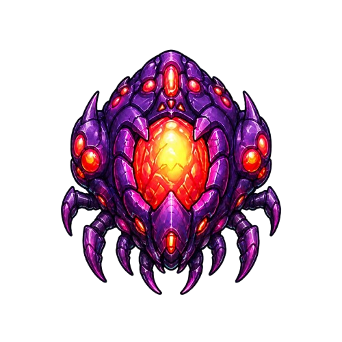 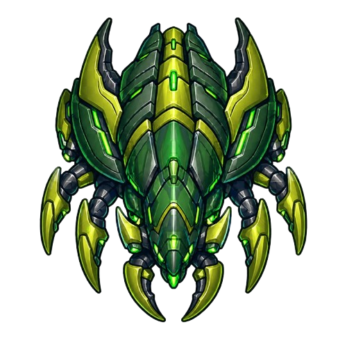 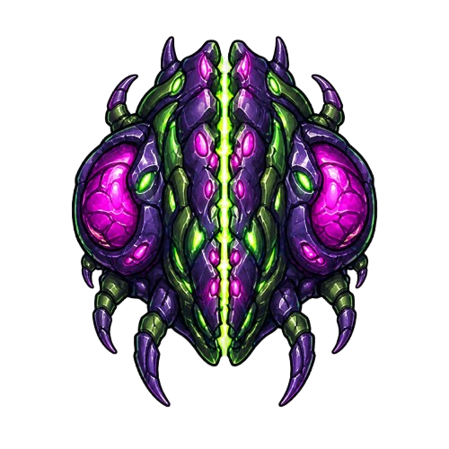 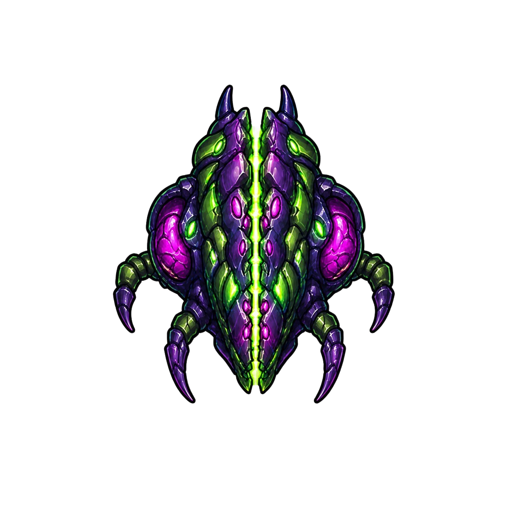
<br/>
왼쪽부터 자폭병 / 원거리병 / 분열병 / 미니언 — 4 종류의 적 스프라이트. 머리 위에 HP 막대가 같이 표시된다.
<br/><br/>
<b>▸ 동작 구성</b><br/>
화면 위쪽에서 등장해 종별로 다른 행동을 한다 — 자폭병/분열병은 화면 중간까지 내려와 플레이어 쪽으로 다이브, 원거리병은 멈춰서 플레이어 방향으로 탄환 발사, 미니언은 분열 직후 사선으로 튀어나간 뒤 락온. 시간이 흐를수록 등장 빈도와 종류 비율이 다양해지고 HP 도 점차 강해진다.
</td>
</tr>
<tr>
<td valign="top"><b>상호작용 정보</b></td>
<td>
플레이어 총알에 맞으면 HP 가 깎이고, 0 이 되면 점수가 가산되며 ExpOrb 가 떨어진다. 단 분열병만 예외 — ExpOrb 대신 미니언 2 마리로 분열한다. 적이 플레이어 본체에 닿거나 적탄이 플레이어에 맞으면 플레이어 HP 감소.
</td>
</tr>
<tr>
<td valign="top"><b>UX 진행 방법</b></td>
<td>
처음엔 자폭병만 내려와서 회피가 쉽지만, 시간이 지나면 원거리·분열형이 섞여 들어와 회피와 처치 판단이 어려워진다. 분열병은 처치해도 적이 더 늘어나니 "잡을지 피할지" 자체가 선택이 된다.
</td>
</tr>
</table>

#### 핵심 코드

**`Enemy.get()` — 오브젝트 풀 팩토리**

```kotlin
val scene = gctx.scene as? MainScene ?: return Enemy(gctx).init(...)
val enemy = scene.world.obtain(Enemy::class.java) ?: Enemy(gctx)
return enemy.init(...)
```

생성자가 `private` 이라 외부에선 이 팩토리만 쓸 수 있다. `scene.world.obtain(Enemy::class.java)` 로 풀에서 사용 가능한 인스턴스를 꺼내고, 풀이 비어있을 때만 `Enemy(gctx)` 로 새로 만든다. 가져온 인스턴스는 `init()` 으로 상태만 초기화해 재사용하므로, 후반에 적이 많이 늘어나도 GC 부담이 거의 발생하지 않는다.

**`lockDiveTarget()` — 자폭병/미니언이 공유하는 락온 다이브**

```kotlin
val dx = player.x - x; val dy = player.y - y
val len = hypot(dx, dy)
val diveSpeed = speed * SUICIDE_DIVE_MUL
diveVx = dx / len * diveSpeed
diveVy = dy / len * diveSpeed
diving = true
```

`(player.x - x, player.y - y)` 로 플레이어 방향 벡터를 구하고 `hypot` 으로 정규화한 뒤, `speed × SUICIDE_DIVE_MUL` (=×1.6) 을 곱해 `diveVx/diveVy` 에 저장하고 `diving = true` 로 만든다. 이후 매 프레임 `update()` 에서 그 속도로 직진하므로, 락온은 호출 시점 한 번만 일어난다.

**`updateRanged()` — 원거리병의 정지 + 발사 패턴**

```kotlin
when (rangedPhase) {
    APPROACHING -> {
        y += speed * gctx.frameTime
        if (y >= gctx.metrics.height * rangedStopRatio) {
            rangedPhase = ATTACKING
            rangedFireCooldown = RANGED_FIRE_INTERVAL
        }
    }
    ATTACKING -> {
        rangedFireCooldown -= gctx.frameTime
        if (rangedFireCooldown <= 0f) {
            rangedFireCooldown = RANGED_FIRE_INTERVAL
            fireRangedBullet(gctx)
        }
    }
}
```

처음엔 `APPROACHING` 상태로 매 프레임 아래로 이동하다가, 화면 위쪽으로부터 22~35% 라인 (등장마다 랜덤, `rangedStopRatio`) 에 도달하면 `ATTACKING` 상태로 전환되고 `rangedFireCooldown` 이 1.2 초로 세팅된다. `ATTACKING` 상태에선 매 프레임 쿨다운을 깎고, 0 이하가 되면 `fireRangedBullet()` 을 호출해 플레이어 방향으로 탄환을 발사한 뒤 쿨다운을 다시 1.2 초로 리셋한다.

**`startDying()` — 종에 따라 분기되는 사망 처리**

```kotlin
if (type != Type.SPLIT) {
    scene.world.add(ExpOrb.get(gctx, x, y), MainScene.Layer.EXP_ORB)
}
if (type == Type.SPLIT) {
    for (angleDeg in MINION_ANGLES) {  // -30°, +30°
        scene.world.add(Enemy.get(gctx, x, Type.SPLIT_MINION, y, angleDeg), MainScene.Layer.ENEMY)
    }
}
```

`type` 이 `SPLIT` 이 아니면 `ExpOrb.get()` 으로 구슬을 만들어 `EXP_ORB` 레이어에 추가한다. `type` 이 `SPLIT` 일 때만 `MINION_ANGLES` (-30°, +30°) 두 방향으로 `Type.SPLIT_MINION` 을 한 마리씩 만들어 `ENEMY` 레이어에 추가한다. `dying = true` + `dyingTime = DIE_DURATION` 으로 0.1 초 뒤 `update()` 에서 `world.remove()` 로 풀에 회수된다.

### Bullet / EnemyBullet / LaserBeam

<table cellpadding="10">
<tr>
<th align="left" width="200">항목</th>
<th align="left">내용</th>
</tr>
<tr>
<td valign="top"><b>클래스 구성 정보</b></td>
<td>
<b>▸ 그림 구성</b><br/>
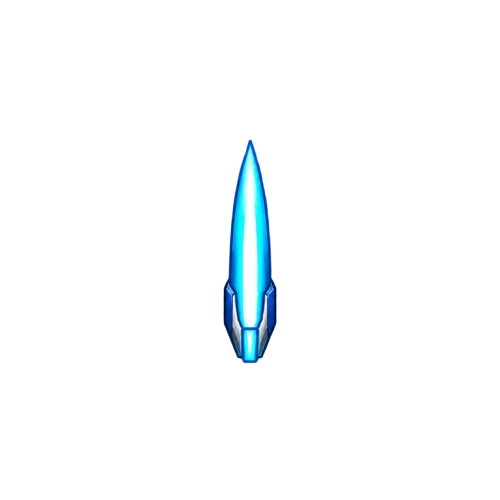 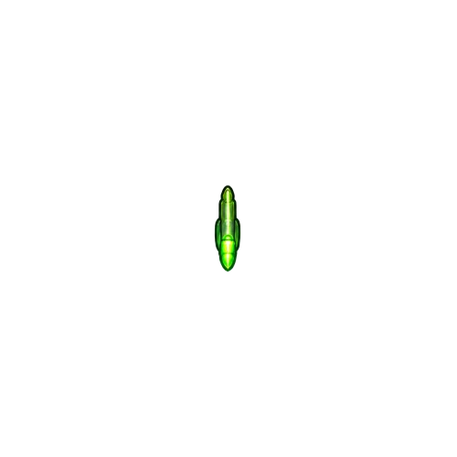 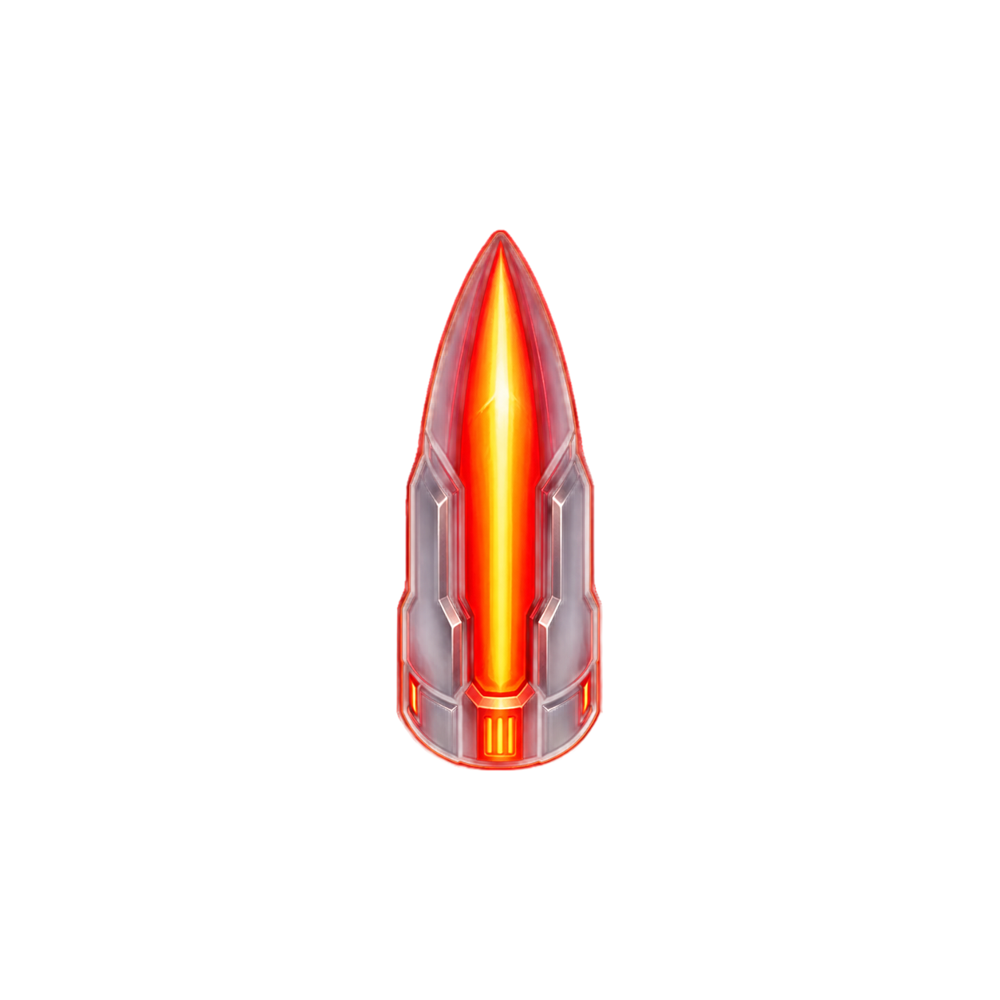 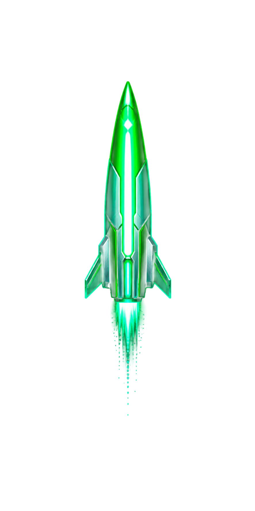 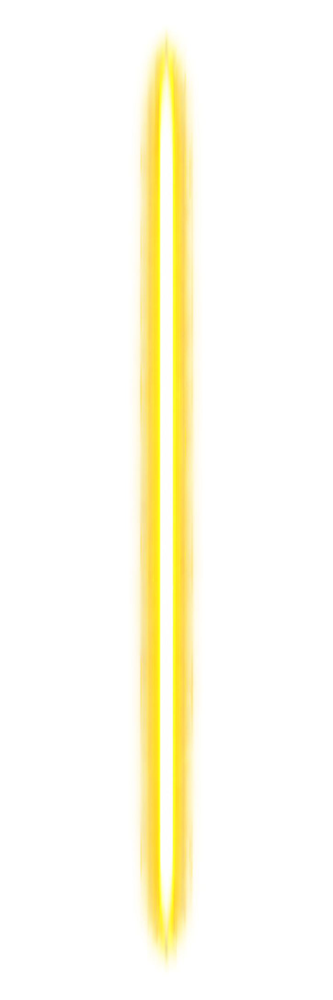
<br/>
왼쪽부터 기본 / 적탄 / 샷건 / 유도 / 레이저 — 5 종류의 총알 스프라이트. 모두 진행 방향에 맞춰 회전된 채 그려진다.
<br/><br/>
<b>▸ 동작 구성</b><br/>
같은 클래스 한 벌을 공유하고 인자만 다르게 줘서 만든다. 발사 후 직진하다 화면 밖이면 사라지고, 유도탄은 가장 가까운 적 방향으로 부드럽게 휘어 들어간다. 레이저만 별도 클래스로 분리되어 직선 영역 안 모든 적에게 매 프레임 데미지를 입힌다.
</td>
</tr>
<tr>
<td valign="top"><b>상호작용 정보</b></td>
<td>
플레이어 총알이 적에 맞으면 잠깐 명중 이펙트가 뜬 뒤 사라진다. 적탄이 플레이어에 맞으면 플레이어 HP 감소. 레이저만 예외적으로 명중 즉시 사라지지 않고 직선 위에 머물면서 그 안의 적 모두에게 매 프레임 데미지를 입힌다.
</td>
</tr>
<tr>
<td valign="top"><b>UX 진행 방법</b></td>
<td>
발사는 자동이라 사용자는 신경 쓸 필요가 없다. 무기 카드를 고르는 즉시 플레이어가 쏘는 총알이 바뀐다. 유도탄은 휘어 들어가는 모션이 보이고, 레이저는 빔이 한 라인의 적을 한 번에 정리한다.
</td>
</tr>
</table>

#### 핵심 코드

**`ShotgunWeapon.fire()` — 부채꼴 산탄**

```kotlin
val pelletCount = if (grade == EPIC) 5 else 3
val totalSpreadDeg = if (grade == EPIC) 40f else 30f
val startAngle = -totalSpreadDeg / 2f
val step = totalSpreadDeg / (pelletCount - 1)
for (i in 0 until pelletCount) {
    val rad = Math.toRadians((startAngle + i * step).toDouble())
    val vx = sin(rad).toFloat() * Bullet.SPEED
    val vy = -cos(rad).toFloat() * Bullet.SPEED
    scene.world.add(Bullet.get(... vx, vy ...), MainScene.Layer.BULLET)
}
```

등급에 따라 `pelletCount` (3 또는 5) 와 `totalSpreadDeg` (30° 또는 40°) 를 정한 뒤, `-spread/2` 부터 `+spread/2` 까지 `step` 간격으로 각도를 만든다. 각 각도를 `sin/cos` 로 분해해 `vx/vy` 를 계산하고, 매 펠릿마다 `Bullet.get()` 으로 만들어 한 번의 `fire()` 호출에서 `pelletCount` 발을 모두 발사한다.

**`HomingWeapon.fire()` — 유도 미사일**

```kotlin
val HomingCount = if (grade == EPIC) 2 else 1
for (i in 0 until HomingCount) {
    val offsetX = if (HomingCount == 2) (i * 2 - 1) * 30f else 0f
    Bullet.get(... player.x + offsetX, muzzleY,
        vx = 0f, vy = -INITIAL_SPEED,
        turnRate = 6f,
        targetSpeed = 1100f)
}
```

등급에 따라 `HomingCount` (1 또는 2) 만큼 발사. 영웅 등급일 땐 `(i*2 - 1) * 30f` 로 좌우에 30px 씩 오프셋을 줘서 두 발이 양옆에서 출발한다. `Bullet.get()` 호출 시 `turnRate=6f`, `targetSpeed=1100f` 를 넘기는데, 이 값들이 `Bullet.update()` 의 호밍 보정 if 블록을 활성화시킨다.

**`LaserWeapon.fire()` — 한 줄 빔**

```kotlin
val beamHalf = if (grade == EPIC) 150f else 60f
scene.world.add(
    LaserBeam.get(gctx, muzzleY, LASER_LIFETIME, beamHalf),
    MainScene.Layer.LASER,
)
```

다른 무기와 달리 `Bullet.get()` 이 아니라 `LaserBeam.get()` 으로 별도 클래스 인스턴스 1 개를 만들어 `BULLET` 이 아닌 `LASER` 레이어에 추가한다. `LASER_LIFETIME` (1 초) 동안 그 자리에 머물고, 등급에 따라 빔의 좌우 폭 (`beamHalf` 60 또는 150) 만 달라진다.

**`Bullet.update()` — 호밍 보정 (직진/유도를 같은 코드로)**

```kotlin
if (turnRate > 0f) {
    val nearest = findNearest(scene)
    if (nearest != null) {
        val dx = nearest.x - x; val dy = nearest.y - y
        val len = hypot(dx, dy)
        if (len > 1f) {
            val turn = turnRate * gctx.frameTime
            vx += (dx / len * targetSpeed - vx) * turn
            vy += (dy / len * targetSpeed - vy) * turn
        }
    }
}
```

`turnRate > 0` 일 때만 호밍 블록 진입. `findNearest()` 로 가장 가까운 적을 찾고, 그 방향 단위 벡터에 `targetSpeed` 를 곱한 목표 속도와 현재 속도 (`vx, vy`) 의 차이에 `turnRate × frameTime` 을 곱해 더한다 — 매 프레임 lerp 형태의 보정. `turnRate = 0` 인 일반 총알은 if 블록을 건너뛰어 그대로 직진한다.

### ExpOrb (경험치 구슬)

<table cellpadding="10">
<tr>
<th align="left" width="200">항목</th>
<th align="left">내용</th>
</tr>
<tr>
<td valign="top"><b>클래스 구성 정보</b></td>
<td>
<b>▸ 그림 구성</b><br/>
청록색 작은 원형 구슬. 이미지 파일 없이 코드로 직접 원을 그린다.
<br/><br/>
<b>▸ 동작 구성</b><br/>
적이 죽은 자리에 드롭되어 플레이어 쪽으로 자동 흡인된다. 시간이 흐를수록 한 개당 EXP 가치가 점차 커진다. 분열병만 예외 — 미니언 분열로 대체되어 드롭하지 않는다.
</td>
</tr>
<tr>
<td valign="top"><b>상호작용 정보</b></td>
<td>
플레이어와 닿으면 흡수되어 EXP 가 적립된다. 적립되는 양은 게임 시간이 흐를수록 점점 커진다.
</td>
</tr>
<tr>
<td valign="top"><b>UX 진행 방법</b></td>
<td>
사용자가 직접 주우러 다닐 필요가 없어 전투에 집중할 수 있다. 시간이 지날수록 한 개당 가치가 커지므로 적이 강해지는 것과 보상의 가속도가 균형을 이룬다.
</td>
</tr>
</table>

#### 핵심 코드

**`update()` — player 방향 자동 흡인**

```kotlin
val dx = player.x - x; val dy = player.y - y
val dist = hypot(dx, dy)
if (dist > 0f) {
    val step = ATTRACT_SPEED * gctx.frameTime
    x += dx / dist * step
    y += dy / dist * step
}
```

`(player.x - x, player.y - y)` 로 플레이어 방향 벡터를 구하고 `hypot` 으로 거리를 잰다. `dist > 0` 이면 단위 벡터 (`dx/dist, dy/dist`) 에 `ATTRACT_SPEED × frameTime` 을 곱해 좌표에 더한다 — 거리와 무관하게 동일 속도로 끌려온다.

**`draw()` — 비트맵 없이 두 번의 `drawCircle`**

```kotlin
canvas.drawCircle(x, y, RADIUS, fillPaint)
canvas.drawCircle(x, y, RADIUS, strokePaint)
```

`fillPaint` 로 한 번 (속) + `strokePaint` 로 한 번 (윤곽선), 두 번의 `drawCircle` 호출로 같은 좌표에 같은 반지름의 원을 겹쳐 그린다. 비트맵 리소스 없이 코드만으로 렌더링.

### SkillButton

<table cellpadding="10">
<tr>
<th align="left" width="200">항목</th>
<th align="left">내용</th>
</tr>
<tr>
<td valign="top"><b>클래스 구성 정보</b></td>
<td>
<b>▸ 그림 구성</b><br/>
 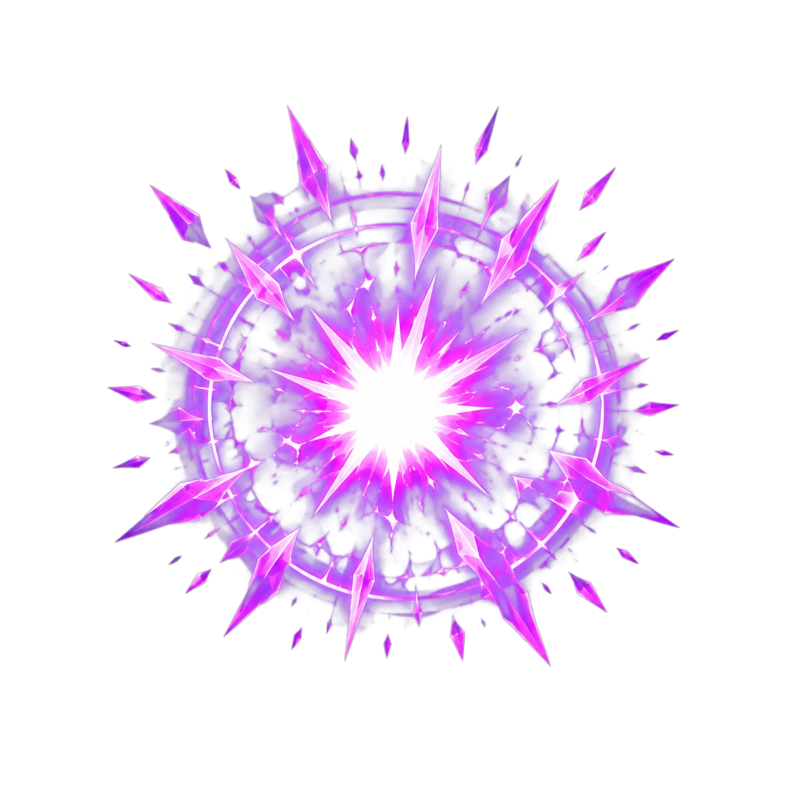 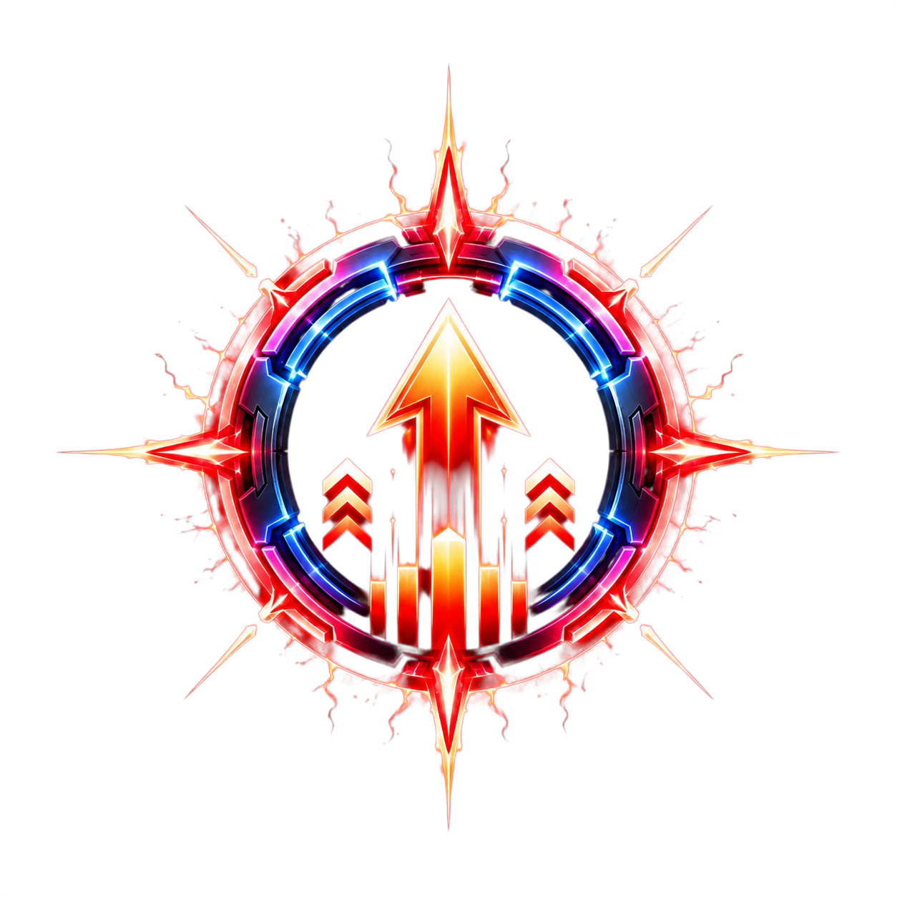
<br/>
왼쪽부터 힐 / 폭발 / 광폭화 — 3 종류의 스킬 아이콘 중 하나가 우하단 원형 버튼에 표시된다. 비어있을 땐 "스킬 / 없음" 두 줄 텍스트, 쿨다운 중엔 위에 어두운 부채꼴이 덮이면서 잔여 초가 같이 보인다.
<br/><br/>
<b>▸ 동작 구성</b><br/>
탭 입력은 4 단계 게이트 (영역 검사 → 스킬 존재 → 쿨다운 종료 → 발동 조건) 를 통과해야 실제 발동되고, 그 결과 스킬 종류에 따라 회복·폭발·버프 등 서로 다른 효과가 일어난다. 카드 보상으로 스킬이 바뀌면 자동으로 인식되어 쿨다운이 리셋된다.
</td>
</tr>
<tr>
<td valign="top"><b>상호작용 정보</b></td>
<td>
버튼 영역 안의 터치는 플레이어 드래그로 흘러가지 않게 막혀, 위급한 순간 스킬을 누르려다 플레이어가 끌려가는 사고가 없다. 발동 조건이 있어서 (예: 힐은 만피일 땐 발동 X) 자원 낭비 없이 의미 있을 때만 효과가 적용된다.
</td>
</tr>
<tr>
<td valign="top"><b>UX 진행 방법</b></td>
<td>
평소엔 자동 발사로 진행하다가 위급한 순간에 한 번 탭하면 폭발·회복·버프가 즉시 들어간다. 쿨다운 동안엔 호가 채워지면서 다음 사용 가능 시점을 알려 준다.
</td>
</tr>
</table>

#### 핵심 코드

**`handleDown()` — 영역 capture + 4 단계 발동 게이트**

```kotlin
if (dx * dx + dy * dy > radius * radius) return false  // 영역 밖 → fall-through

val skill = scene.player.currentSkill ?: return true
if (cooldown > 0f) return true
if (!skill.canActivate(scene.player)) return true

skill.activate(scene.player, scene)
cooldown = skill.cooldownTime
return true
```

터치 좌표와 중심 (`centerX, centerY`) 의 거리² 가 `radius²` 보다 크면 (영역 밖) `false` 를 반환해 플레이어 드래그로 흘려보낸다. 영역 안이면 무조건 `true` 를 반환한 뒤, `currentSkill ≠ null` + `cooldown ≤ 0` + `canActivate() == true` 3 조건이 모두 만족될 때만 `skill.activate()` 를 호출하고 `cooldown` 을 `cooldownTime` 으로 세팅한다.

**`update()` — 스킬 교체 자동 감지**

```kotlin
val skill = (gctx.scene as? MainScene)?.player?.currentSkill
if (skill !== lastSkill) {
    cooldown = 0f
    lastSkill = skill
}
```

매 프레임 플레이어의 `currentSkill` 참조를 자기가 들고 있는 `lastSkill` 과 `!==` 로 비교한다. 다르면 `cooldown` 을 0 으로 리셋하고 `lastSkill` 을 새 값으로 갱신한다.

**`draw()` — 쿨다운 sweep arc**

```kotlin
val ratio = (cooldown / skill.cooldownTime).coerceIn(0f, 1f)
canvas.drawArc(rectF, -90f, ratio * 360f, true, cooldownPaint)
```

`cooldown / skill.cooldownTime` 비율 (1 → 0) 을 0~1 로 클램프하고 360° 를 곱해 호 길이 (`sweepAngle`) 를 만든다. `drawArc` 로 12 시 (`-90°`) 에서 시계방향으로 그 길이만큼 부채꼴을 그린다.

### Skill (힐 / 폭발 / 광폭화)

<table cellpadding="10">
<tr>
<th align="left" width="200">항목</th>
<th align="left">내용</th>
</tr>
<tr>
<td valign="top"><b>클래스 구성 정보</b></td>
<td>
<b>▸ 그림 구성</b><br/>
스킬 자체는 화면에 그려지지 않고, 발동 시 SkillVfx 가 대신 시각화한다. 아이콘은 SkillButton 에 표시된다.
<br/><br/>
<b>▸ 동작 구성</b><br/>
3 종 스킬 (힐 / 폭발 / 광폭화) 이 같은 sealed class 를 상속해 각자 다른 효과를 낸다. 힐만 발동 조건 (만피일 땐 발동 X) 이 있고, 광폭화만 7 초간 지속되며 나머지는 즉발 1 회성.
</td>
</tr>
<tr>
<td valign="top"><b>상호작용 정보</b></td>
<td>
힐은 플레이어 HP 5 회복, 폭발은 플레이어 위쪽 일정 범위 안의 적 모두에게 50 데미지, 광폭화는 7 초간 공격력 ×3 + 공속 ×2. 발동 후엔 SkillButton 의 쿨다운 (10/12/18 초) 동안 다음 발동을 막는다.
</td>
</tr>
<tr>
<td valign="top"><b>UX 진행 방법</b></td>
<td>
HP 가 부족하면 힐, 적이 몰려 있으면 폭발, 보스 도전 직전엔 광폭화 — 상황에 맞는 스킬을 카드로 골라 빌드를 만든다. 빌드에 따라 위급한 순간의 대처가 완전히 달라진다.
</td>
</tr>
</table>

#### 핵심 코드

**`HealSkill` — 회복 스킬 (조건부 발동)**

```kotlin
override fun canActivate(player: Player): Boolean = player.life < player.maxLife

override fun activate(player: Player, scene: MainScene) {
    player.heal(HEAL_AMOUNT)  // 5
    scene.spawnVfx(R.mipmap.skill_heal, player.x, player.y, ...)
}
```

`canActivate()` 가 `player.life < player.maxLife` 를 반환 — 만피일 땐 false 가 되어 SkillButton 이 `activate()` 호출 자체를 차단한다. `activate()` 는 `player.heal(HEAL_AMOUNT=5)` 로 HP 를 회복한 뒤, 플레이어 좌표에 1 회성 VFX 를 spawn 한다.

**`ExplosionSkill` — 광역 데미지**

```kotlin
override fun activate(player: Player, scene: MainScene) {
    val cx = player.x; val cy = player.y - Y_OFFSET_UP  // 700
    scene.applyAreaDamage(cx, cy, RADIUS, DAMAGE)       // 480 / 50
    scene.spawnVfx(R.mipmap.skill_explosion, cx, cy, ...)
}
```

중심점 `(player.x, player.y - Y_OFFSET_UP=700)` 을 잡고, `scene.applyAreaDamage()` 로 반경 `RADIUS=480` 안의 모든 적에게 `DAMAGE=50` 을 한 번에 적용한다. 같은 좌표에 1 회성 폭발 VFX 도 spawn.

**`BuffSkill` — 광폭화 (지속 + 추종 VFX)**

```kotlin
override fun activate(player: Player, scene: MainScene) {
    player.applyBuff(ATTACK_BUFF, FIRE_RATE_BUFF, DURATION)  // ×3, ×2, 7초
    scene.spawnVfx(R.mipmap.skill_buff, player.x, player.y,
        loops = true,
        followTarget = player,
    )
}
```

`player.applyBuff(ATTACK_BUFF=3f, FIRE_RATE_BUFF=2f, DURATION=7f)` 로 플레이어의 `attackBuffMul/fireRateBuffMul/buffRemaining` 을 한 번에 세팅. VFX 는 `loops=true` + `followTarget=player` 로 spawn 되어 7 초 동안 플레이어 위치를 매 프레임 따라가며 시트를 반복 재생한다.

### SkillVfx (스킬 발동 시 화면에 잠깐 표시되는 이펙트)

<table cellpadding="10">
<tr>
<th align="left" width="200">항목</th>
<th align="left">내용</th>
</tr>
<tr>
<td valign="top"><b>클래스 구성 정보</b></td>
<td>
<b>▸ 그림 구성</b><br/>
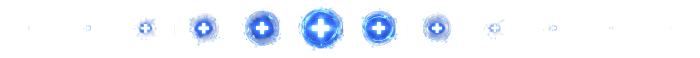<br/>
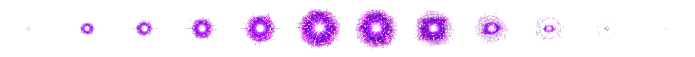<br/>
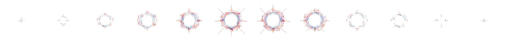
<br/><br/>
위에서부터 힐 / 폭발 / 광폭화 — 3 종류의 가로 strip 스프라이트 시트.
<br/><br/>
<b>▸ 동작 구성</b><br/>
시트를 12 fps 애니메이션으로 자동 분할 재생한다. 한 클래스가 세 모드 (1 회성·지속형·추종형) 를 모두 처리하며, 광폭화만 지속형+추종형으로 7 초간 플레이어 머리 위를 따라다니는 오라가 되고 나머지는 한 번 재생 후 소멸.
</td>
</tr>
<tr>
<td valign="top"><b>상호작용 정보</b></td>
<td>
시각 효과 전용이라 충돌 검사에는 등장하지 않는다. 데미지 판정은 스킬 측에서 별도로 처리하고, 이 클래스는 그 영역을 시각적으로 보여 주는 역할만 한다. 지속 시간이 끝나면 자기 자신을 화면에서 제거한다.
</td>
</tr>
<tr>
<td valign="top"><b>UX 진행 방법</b></td>
<td>
스킬 효과의 위치와 범위를 한눈에 인식하게 만든다. 광폭화는 플레이어 머리 위에 오라가 7 초간 따라다녀 "지금 강화 중" 임을 의식하게 하고, 폭발은 플레이어 위쪽 공중의 큰 충격파로 광역 데미지 범위를 명확히 보여 준다.
</td>
</tr>
</table>

#### 핵심 코드

**`update()` — 추종 + 자동 제거**

```kotlin
followTarget?.let {
    x = it.x; y = it.y
    syncDstRect()
}
elapsed += gctx.frameTime
if (elapsed >= durationSec) {
    done = true
    (gctx.scene as? MainScene)?.world?.remove(this, MainScene.Layer.VFX)
}
```

`followTarget` 이 null 이 아니면 매 프레임 `followTarget.x/y` 를 자기 좌표로 복사해 따라간다. `elapsed` 에 `frameTime` 을 누적하다가 `durationSec` 에 도달하면 `done = true` 로 만들고 `world.remove()` 로 자신을 제거한다. `followTarget = null` 인 1 회성 이펙트는 좌표만 고정된 채 같은 흐름으로 처리된다.

**`draw()` — 1 회성 / 반복 프레임 인덱스 선택**

```kotlin
val raw = (elapsed * fps).toInt()
val frameIndex = if (loops) {
    if (frameCount > 0) raw % frameCount else 0
} else {
    raw.coerceIn(0, frameCount - 1)
}
```

`(elapsed × fps).toInt()` 로 raw 인덱스를 만들고, `loops=true` 면 `raw % frameCount` 로 순환시키고, false 면 `coerceIn(0, frameCount-1)` 으로 마지막 프레임에 클램프한다. 같은 인덱스를 `srcRect` 에 세팅해 시트의 해당 프레임을 잘라 그린다.

### HUD 클래스 (사용자 정보 표시)

매 프레임 player/scene 상태를 읽어 텍스트로 보여 주는 단순 라벨 묶음. 각각 한 가지 값만 책임진다.

#### ScoreLabel

<table cellpadding="10">
<tr>
<th align="left" width="200">항목</th>
<th align="left">내용</th>
</tr>
<tr>
<td valign="top"><b>클래스 구성 정보</b></td>
<td>
<b>▸ 그림 구성</b><br/>
화면 좌측 상단의 "Score: &lt;누적점수&gt;" 흰색 텍스트.
<br/><br/>
<b>▸ 동작 구성</b><br/>
실제 점수와 별개로 천천히 따라가는 rolling counter — 적 처치 직후 점수가 한 번에 튀지 않고 부드럽게 카운트업된다.
</td>
</tr>
<tr>
<td valign="top"><b>상호작용 정보</b></td>
<td>
적이 처치될 때마다 점수가 가산되고, 이 라벨은 그 결과를 따라가기만 한다.
</td>
</tr>
<tr>
<td valign="top"><b>UX 진행 방법</b></td>
<td>
점수가 커질수록 그만큼 강해진 빌드라는 시각적 피드백. 콤보로 한꺼번에 죽이면 카운터가 빠르게 올라가는 모습이 그 임팩트를 강화한다.
</td>
</tr>
</table>

**핵심 코드 — `update()` 의 rolling counter**

```kotlin
displayScore += when {
    diff in -9..-1 -> -1
    diff in 1..9 -> 1
    else -> diff / 10
}
```

매 프레임 `diff = scene.score - displayScore` 를 계산하고, 절댓값이 9 이하면 ±1, 그보다 크면 `diff / 10` 만큼씩 `displayScore` 를 더한다. 작은 차이는 1 씩, 큰 차이는 10 분의 1 씩 따라잡는다.

#### BossTimerHud

<table cellpadding="10">
<tr>
<th align="left" width="200">항목</th>
<th align="left">내용</th>
</tr>
<tr>
<td valign="top"><b>클래스 구성 정보</b></td>
<td>
<b>▸ 그림 구성</b><br/>
화면 상단 중앙의 둥근 사각형 박스 (검은 반투명 배경 + 오렌지 윤곽선) 안에 오렌지색 굵은 텍스트.
<br/><br/>
<b>▸ 동작 구성</b><br/>
일반 스테이지에선 게임 시작 후 흐른 시간을 mm:ss 로 표시, 보스 스테이지에 들어가면 같은 박스 안의 텍스트가 "BOSS STAGE" 로 바뀐다.
</td>
</tr>
<tr>
<td valign="top"><b>상호작용 정보</b></td>
<td>
시간이 15 초에 도달하면 보스 진입 결정 UI 가 뜨고, 이 HUD 는 그 흐름과 무관하게 시간만 비춰 준다.
</td>
</tr>
<tr>
<td valign="top"><b>UX 진행 방법</b></td>
<td>
다음 보스 입장 타이밍을 인지하는 핵심 지표. 시간이 보일 때는 "지금 강해질지" 의 카운트다운, "BOSS STAGE" 가 뜨면 "이제 진짜 싸움" 의 신호로 바뀐다.
</td>
</tr>
</table>

#### PlayerHpHud

<table cellpadding="10">
<tr>
<th align="left" width="200">항목</th>
<th align="left">내용</th>
</tr>
<tr>
<td valign="top"><b>클래스 구성 정보</b></td>
<td>
<b>▸ 그림 구성</b><br/>
화면 좌하단의 "HP" 라벨 + 그 아래 가로 막대 게이지 (초록 단색).
<br/><br/>
<b>▸ 동작 구성</b><br/>
플레이어의 HP 비율을 게이지에 그대로 반영. 자체 애니메이션 없이 HP 가 깎이는 즉시 게이지도 같이 줄어든다.
</td>
</tr>
<tr>
<td valign="top"><b>상호작용 정보</b></td>
<td>
HP 가 깎이거나 회복되는 즉시 게이지에 반영된다.
</td>
</tr>
<tr>
<td valign="top"><b>UX 진행 방법</b></td>
<td>
HP 가 줄어드는 게 게이지로 즉각 보여 자기 생존 상태를 직관적으로 인식하게 한다. 게이지가 짧아진다는 시각적 위협이 회피 행동을 자연스럽게 유도한다.
</td>
</tr>
</table>

#### ExpLabel

<table cellpadding="10">
<tr>
<th align="left" width="200">항목</th>
<th align="left">내용</th>
</tr>
<tr>
<td valign="top"><b>클래스 구성 정보</b></td>
<td>
<b>▸ 그림 구성</b><br/>
HP 게이지 오른쪽의 "Lv.N  EXP a/b" 형식 청록색 텍스트.
<br/><br/>
<b>▸ 동작 구성</b><br/>
플레이어의 현재 레벨과 다음 레벨까지의 EXP 진행도를 그대로 표시. 자체 게이지 없이 숫자로만.
</td>
</tr>
<tr>
<td valign="top"><b>상호작용 정보</b></td>
<td>
ExpOrb 를 흡수하면 숫자가 올라가고, 가득 차면 레벨이 오르며 카드 보상 UI 가 뜬다.
</td>
</tr>
<tr>
<td valign="top"><b>UX 진행 방법</b></td>
<td>
다음 레벨업까지 얼마나 남았는지를 숫자로 즉각 인식. 레벨업 직전 카드 보상에 대한 기대감을 유도하는 카운터 역할.
</td>
</tr>
</table>

#### DebugStatLabel

<table cellpadding="10">
<tr>
<th align="left" width="200">항목</th>
<th align="left">내용</th>
</tr>
<tr>
<td valign="top"><b>클래스 구성 정보</b></td>
<td>
<b>▸ 그림 구성</b><br/>
화면 좌하단 (HP 게이지 아래) 의 모노스페이스 텍스트. "ATK x1.50 ATTACKSPEED x1.20 CRIT 30%" 형식으로 한 줄 표시.
<br/><br/>
<b>▸ 동작 구성</b><br/>
공격력·공속·치명타 확률 각각의 카드 곱과 광폭화 버프 곱이 모두 적용된 <i>효과 수치</i> 를 보여 준다. 평소엔 흰색, 광폭화 동안엔 빨간색으로 자동 전환된다.
</td>
</tr>
<tr>
<td valign="top"><b>상호작용 정보</b></td>
<td>
카드 보상으로 능력치가 강화되거나 광폭화가 켜지면 그 결과가 즉시 숫자로 반영된다.
</td>
</tr>
<tr>
<td valign="top"><b>UX 진행 방법</b></td>
<td>
디버그/시연용 라벨 — 카드 보상이 능력치에 어떻게 반영됐는지 숫자로 확인 가능. 광폭화 동안 빨간색으로 바뀌면서 버프가 적용된 실제 수치를 보여 주어 강화 체감을 분명하게 만든다.
</td>
</tr>
</table>

### 컨트롤러 (보이지 않지만 게임을 돌리는 역할)

화면에 직접 그려지지 않지만 매 프레임 게임 흐름을 책임지는 두 클래스.

#### EnemyGenerator

<table cellpadding="10">
<tr>
<th align="left" width="200">항목</th>
<th align="left">내용</th>
</tr>
<tr>
<td valign="top"><b>클래스 구성 정보</b></td>
<td>
<b>▸ 그림 구성</b><br/>
화면에 직접 그려지지 않는 컨트롤러. 사용자에게는 "적이 일정 간격으로 화면 위쪽에서 떨어진다" 는 결과만 보인다.
<br/><br/>
<b>▸ 동작 구성</b><br/>
시간 기반 적 스폰. 시간이 흐를수록 등장 간격이 짧아지고 자폭/원거리/분열 종별 가중치가 변해 등장 비율이 다양해진다.
</td>
</tr>
<tr>
<td valign="top"><b>상호작용 정보</b></td>
<td>
적이 만들어질 때마다 풀 팩토리에서 꺼내 재사용한다. 게임이 진행될수록 스폰 간격이 짧아지지만 일정 한도까지만 — 무한정 빨라지진 않는다.
</td>
</tr>
<tr>
<td valign="top"><b>UX 진행 방법</b></td>
<td>
0~5 초 자폭병만 등장, 그 후 원거리·분열형이 차례로 섞여 들어와 후반으로 갈수록 회피와 처치 판단이 자연스럽게 어려워진다.
</td>
</tr>
</table>

**핵심 코드 — `pickType()` (시간 기반 가중치 랜덤)**

```kotlin
val rangedWeight = ((elapsedSec - RANGED_START_SEC) / RANGED_RAMP_SEC)
    .coerceIn(0f, RANGED_MAX_WEIGHT)
val splitWeight = ((elapsedSec - SPLIT_START_SEC) / SPLIT_RAMP_SEC)
    .coerceIn(0f, SPLIT_MAX_WEIGHT)
val total = SUICIDE_BASE_WEIGHT + rangedWeight + splitWeight
val r = Random.nextFloat() * total
return when {
    r < SUICIDE_BASE_WEIGHT -> Type.SUICIDE
    r < SUICIDE_BASE_WEIGHT + rangedWeight -> Type.RANGED
    else -> Type.SPLIT
}
```

RANGED 와 SPLIT 의 가중치를 `(elapsedSec - START_SEC) / RAMP_SEC` 로 계산해 0 ~ MAX 사이로 클램프 — 시간이 흐를수록 0 에서 최대치까지 선형 증가한다. SUICIDE 가중치 + 두 가중치 합 × `Random.nextFloat()` 로 랜덤 값을 뽑고 누적 비교로 한 종을 선택한다. 5 초 이전엔 자폭병만, 30 초 이후엔 세 종이 거의 균등하게 등장한다.

#### CollisionChecker

<table cellpadding="10">
<tr>
<th align="left" width="200">항목</th>
<th align="left">내용</th>
</tr>
<tr>
<td valign="top"><b>클래스 구성 정보</b></td>
<td>
<b>▸ 그림 구성</b><br/>
충돌 검사 자체는 화면에 그려지지 않지만, 적이 총알에 맞을 때 뜨는 <b>데미지 숫자 popup</b> 만 이 클래스가 직접 그린다. 일반 명중은 흰색, 치명타는 노란색 + 더 큰 글자로 표시되고, 시간이 지나며 위로 떠오르며 사라진다.
<br/><br/>
<b>▸ 동작 구성</b><br/>
매 프레임 모든 충돌 (플레이어 ↔ 적/적탄, 총알 ↔ 적, ExpOrb ↔ 플레이어) 을 한 곳에서 검사하고 데미지·점수·EXP 적립을 일괄 처리한다.
</td>
</tr>
<tr>
<td valign="top"><b>상호작용 정보</b></td>
<td>
적이 맞을 때마다 데미지 숫자가 뜨고, 사망 시 점수와 EXP 가 가산된다. 분열병 처치 시엔 미니언 2 마리가 분열한다. 플레이어가 죽으면 게임이 종료된다.
</td>
</tr>
<tr>
<td valign="top"><b>UX 진행 방법</b></td>
<td>
데미지 popup 은 치명타 시 노란색 + 더 큰 글자로 표시되어, 카드/스킬 빌드의 강함이 적 처치마다 즉각 체감된다.
</td>
</tr>
</table>

**핵심 코드 — 충돌 + 데미지 popup 일괄 처리**

```kotlin
if (bullet.collidesWith(enemy)) {
    bullet.startHitting()
    enemy.decreaseLife(bullet.power)
    spawnPopup(enemy.x, enemy.y, bullet.power, bullet.isCrit)
    if (enemy.dead) {
        enemy.startDying(scene)
        scene.addScore(enemy.score)
    }
}
```

`bullet.collidesWith(enemy)` 가 true 일 때 if 한 블록 안에서 (1) `bullet.startHitting()` 으로 명중 이펙트 시작, (2) `enemy.decreaseLife(bullet.power)` 로 HP 감소, (3) `spawnPopup()` 으로 데미지 숫자 생성, (4) `enemy.dead` 면 `enemy.startDying(scene)` + `scene.addScore(enemy.score)` — 한 발 명중 시 발생할 모든 일이 한 곳에서 일어난다.

**`spawnPopup()` — popup 풀 재사용**

```kotlin
val p = if (popupPool.isNotEmpty()) popupPool.removeAt(popupPool.lastIndex) else DamagePopup()
p.x = x + POPUP_X_OFFSET; p.startY = y; p.y = y
p.age = 0f; p.lifetime = lifetime
p.power = power; p.isCrit = isCrit
popups.add(p)
```

`popupPool` 이 비어있지 않으면 마지막 인스턴스를 꺼내 재사용 — 비어있을 때만 `new DamagePopup()` 으로 만든다. 좌표/age/lifetime/power/isCrit 만 새로 세팅하고 `popups` 리스트에 다시 추가. 수명이 끝난 popup 은 `popups` 에서 빠져 다시 `popupPool` 로 들어가므로, 후반에 popup 이 많이 늘어도 GC 압력이 거의 발생하지 않는다.

---

## 7. UX 진행 방법

> 사용자 입장에서 한 판이 어떻게 흘러가는지의 표준 시나리오.

### ① 진입

1. 앱 실행 → `MainActivity` 의 **Start Game** 버튼 탭
2. `SkyBlasterActivity` 가 켜지고 `MainScene` 이 root 로 push 됨 → 즉시 게임 시작 (별도 로딩/튜토리얼 없음)

### ② 평상시 조작

- **이동**: 화면 어디든 손가락으로 누른 채 드래그 → player 가 손가락 위치로 부드럽게 따라옴 (`SPEED = 1100f/s` 보간). 손을 떼면 그 자리에 정지.
- **공격**: 자동 발사. 사용자는 신경 쓸 필요 없음. 현재 무기에 따라 발사 패턴이 다름 (단발 / 샷건 / 유도 / 레이저).
- **스킬 발동**: 우하단 원형 SkillButton 을 탭. 빈 슬롯 ("스킬 없음") 일 땐 무반응. 쿨다운 중에는 sweep 호로 잔여 시간을 시각화.
- **SkillButton 영역 안 터치는 player 이동에 절대 반영되지 않음** (capture). 위급한 순간에 손가락이 player 를 끌어당기는 사고를 방지.

### ③ 레벨업 흐름

1. 적 처치 시 `ExpOrb` 드롭 → 일정 거리 안에 들어가면 player 쪽으로 빨려옴
2. 흡수 시 `expPerOrb()` (시간 비례 1, 2, 3...) 만큼 EXP 적립
3. `exp >= maxExp` 가 되면 게임이 잠시 멈추고 **LevelUpScene** 이 push (반투명 오버레이)
4. **카드 3장** 중 1장을 탭으로 선택 — 무기 / 스킬 / 능력치 카드가 섞여 등장
5. 선택 즉시 보상 적용 + scene pop → 게임 재개

### ④ 보스 도전 시점 선택

1. `elapsedSec` 누적이 15초 (`BOSS_ENTER_TIME`) 에 도달 → **BossEntryScene** 자동 push
2. 화면이 어두워지며 "WARNING — 보스 스테이지로 진입하시겠습니까?" + 두 버튼 표시
3. 사용자 판단:
   - **"보스 도전"** → pop + `BossScene.change()` 로 root 교체 (되돌아갈 수 없음)
   - **"계속 사냥"** → pop + `dismissBossPrompt()` 로 다음 트리거 시점을 +15초 미루고 일반 스테이지 계속
4. overlay 가 떠 있는 동안은 게임 시간/적 스폰 모두 정지하므로 사용자가 빌드 상태를 안전하게 점검 가능

### ⑤ 한 판 종료

- **GAME OVER**: player `life ≤ 0` 시 (※ 결과 화면은 7주차 미구현, 현재는 게임 오버 처리만)
- **BOSS CLEAR**: 보스 처치 시 (※ 보스 자체가 6주차 미구현이므로 현 시점 도달 불가)
- 다음 판은 다시 빈 빌드 (무기 = `DefaultWeapon`, 스킬 = `null`, attackMul/fireRateMul/critRate = 초기값) 로 시작

### ⑥ 시간이 흐를수록 변하는 것 (사용자 체감)

| 시간 | 변화 |
|------|------|
| 0~5초 | 자폭병만 등장, 천천히 |
| ~10초 | 원거리 몬스터 가중치 상승 → 화면 위쪽에서 탄환이 날아오기 시작 |
| ~20초 | 분열형 등장 → 처치 시 미니언 2마리 분열, 회피 부담 급증 |
| 누적 | 적 HP 최대 ×4, 스폰 빈도 최대 ×5, EXP 1개당 가치도 함께 상승 (cap 존재) |

설계 의도: **위험과 보상이 함께 커지므로 "지금 보스 갈까 / 한 번 더 강해질까" 판단을 사용자가 매 15초마다 자발적으로 내리게** 만든다.
